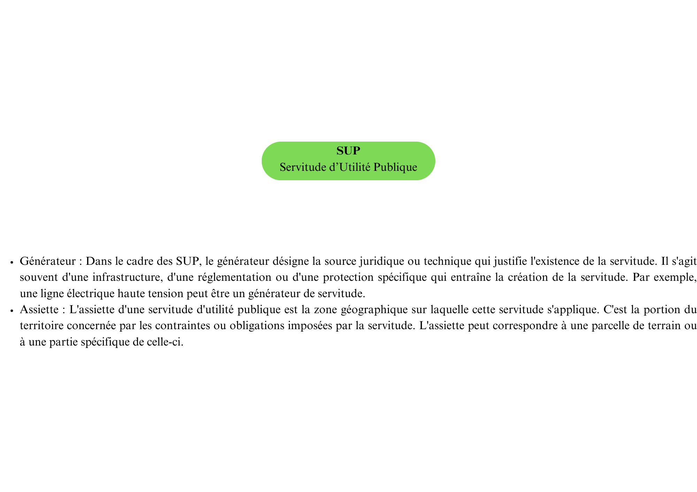

# **Rapport du projet enjeux patrimoniaux**

# Auteurs : Ninon Delattre, Adèle Desaint, Sylvain Giraudo, Cyril Guillaumant, Louise Rovel 

# Date : 13/09/2024

# Introduction

## Présentation globale du projet

La gestion d'un massif forestier et l'écriture de documents d'aménagement nécessitent de s'intéresser aux enjeux environnants dont les enjeux patrimoniaux. Ces informations (telles que les monuments historiques, les sites inscrits et classés, les aligements d'arbres etc...) se trouvent dans des documents d'urbanisme (PLU, PLUi, CC, PSMV) ainsi que dans des SUP (Servitudes d'Utilité Publique) et des SCOT (Schémas de Cohérence Territoriale). Elles sont regroupées sur le géoportail de l'urbanisme.

## Justification du besoin des données relatives aux enjeux patrimoniaux

Il est nécessaire de s'intéresser aux enjeux patrimoniaux d'un massif forestier car il en découle des contraintes voire des interdictions. Chaque prescription ou information de document d'urbanisme et chaque SUP est liée à un article de loi ou à un réglement des codes forestier, de l'urbanisme, du patrimoine ou de l'environnement, qui en stipule les conséquences. Par exemple, une prescription ayant trait au patrimoine bâti ou paysager à protéger est liée à l'article L151-19 du code de l'urbanisme, qui stipule qu'il est obligatoire d'assurer leur préservation, leur conservation ou leur restauration.

## Description des documents d'aménagements (et SUP)

Le géoportail de l'urbanisme (GPU) permet d'acceder aux informations de différents documents d'urbanisme :

-   PLU (Plan Local d’Urbanisme) :\
    Le PLU est un document d'urbanisme à l'échelle communale qui définit les règles de construction et d'aménagement pour l'ensemble du territoire de la commune. Il détermine notamment l'affectation des sols, les zones constructibles, les hauteurs maximales des constructions, etc.

-   CC (Carte Communale) :\
    La Carte Communale est un document d'urbanisme simplifié qui délimite les zones constructibles et non constructibles sur le territoire d'une commune. Elle est utilisée principalement dans les petites communes qui ne disposent pas d'un PLU.

-   PSMV (Plan de Sauvegarde et de Mise en Valeur) :\
    Le PSMV est un document d'urbanisme spécifique aux secteurs sauvegardés, généralement des centres historiques, où il fixe des règles précises de préservation et de mise en valeur du patrimoine bâti. Il régit les travaux de construction, de rénovation, ou de démolition dans ces secteurs.

-   PLUi (Plan Local d’Urbanisme intercommunal) :\
    Le PLUi est un PLU qui s'applique non pas à une seule commune, mais à un ensemble de communes (intercommunalité). Il permet une planification cohérente et concertée à l'échelle de plusieurs communes.

-   SCOT (Schéma de Cohérence Territoriale) :\
    Le SCOT est un document de planification stratégique qui fixe les grandes orientations de l’aménagement du territoire à l'échelle de plusieurs communes ou d'une intercommunalité. Il couvre des domaines comme l'urbanisme, le logement, les transports, et l'environnement.

-   RNU (Règlement National d’Urbanisme) :\
    Le RNU est un ensemble de règles d'urbanisme qui s'appliquent dans les communes qui ne disposent pas de documents d'urbanisme locaux (comme un PLU). Ces règles définissent les conditions de construction et d'aménagement du territoire au niveau national.

-   SUP (Servitudes d’Utilité Publique) :\
    Les SUP sont des contraintes administratives imposées à certaines propriétés privées dans l'intérêt général. Elles sont liées à la présence d’infrastructures, de protections environnementales, ou de risques naturels, et limitent les droits d'usage et de construction sur les terrains concernés.

Ces différents documents jouent un rôle clé dans l'aménagement du territoire en France, en encadrant les projets d'urbanisme et en garantissant une cohérence entre les différents niveaux de planification (source : <https://www.legifrance.gouv.fr/codes/section_lc/LEGITEXT000006074075/LEGISCTA000031210062/#LEGISCTA000031212669>). Cependant, ils ne sont pas équivalents. Certains servent de substitution en l'absence de certains documents et d'autres prévalent sur le reste (<https://www.legifrance.gouv.fr/jorf/id/JORFTEXT000042007747/>).




## Problématique

La nécessité de s'intéresser aux enjeux patrimoniaux pousse à automatiser l'importation des données regroupées sur le géoportail de l'urbanisme. Pour cela, il faudra d'abord identifier les documents d'urbanisme, SCOT ou SUP existant sur notre zone d'étude, puis récupérer les données utiles dans ces documents. 


# Matériel et Méthode

## Utilisation du géoportail de l'urbanisme : identification des documents d'urbanisme et tri des données utilisées

Comme dit précedemment, l'ensemble des données provenant des documents 
d'urbanisme, SCOT et SUP sont rassemblées sur le géoportail de l'urbanisme. 
Notre projet consiste à récupérer ces données. Il est donc nécessaire
de comprendre ce qui identifie les documents, et aussi comment les données y 
sont organisées, afin de trier ces données en fonction de si elles ont trait aux 
enjeux patrimoniaux voire, de manière plus large, si elles permettent d'écrire 
un document d'aménagement.   

Les documents d'urbanisme, les SCOT et les SUP sont identifiés par deux éléments :  
une partition et une localisation. 
La manière dont sont construites ces partitions, ainsi que ce que
contient chaque document, est disponible ici pour les documents d'urbanisme :  
https://cnig.gouv.fr/ressources-dematerialisation-documents-d-urbanisme-a2732.html.   
et ici pour les SUP :   
https://www.geoinformations.developpement-durable.gouv.fr/fichier/pdf/tableau_alpha-numerique_des_supet_base_legale_maj_20_06_24_2_cle7dbc5e.pdf?arg=177836385&cle=0ef0d333b5d4e35418b5f3b71d2d3849a002c26f&file=pdf%2Ftableau_alpha-numerique_des_supet_base_legale_maj_20_06_24_2_cle7dbc5e.pdf. 

Les partitions des documents d'urbanisme sont faciles à trouver
car elles ne prennent en compte que le type de document et le code INSEE des
communes, à l'exception des PLUi et des SUP. Les partitions des PLUi 
comprennent les codes des communautés de commune, tandis que les SUP, qui ne 
sont pas par définition des documents d'urbanisme, ont une partition 
complètement différente. 

Ainsi, afin de savoir s'il existe des documents d'urbanisme en un 
endroit donné, on récupère les codes INSEE des communes correspondantes, qui
sont nécessaire pour savoir si la commune est soumise à un RNU. Si elle ne l'est
pas, c'est qu'il existe d'autres documents d'urbanisme. Pour les PLUi, c'est 
plus compliqué, mais le package happign et la fonction get_apicarto_gpu permet
de les retrouver.

Pour savoir s'il existe des SUP, c'est beaucoup moins aisé, il est donc 
nécessaire d'utiliser plutôt leur localisation. Ce sera la méthode utilisée 
également pour récupérer toutes les données utiles au sein des documents 
d'urbanisme et des SUP, une fois que l'on sait qu'ils existent. 

Ensuite, il est nécessaire d'utiliser ces standards pour trier 
les données utiles aux forestiers, pour identifier les enjeux patrimoniaux par 
exemple, mais l'on verra par la suite que d'autres données intéressantes sont 
aussi disponibles. On prend donc une à une chacune des prescriptions et 
informations des documents d'urbanisme, et chacun des types de SUP, pour
identifier si elles correspondent à des enjeux patrimoniaux. Pour cela, il est
souvent nécessaire de se référer aux articles de loi ou réglements qu'elles
appliquent. 

## Packages R : happign, tmap, sf, dplyr 

Un certain nombre de packages ont été utilisés pour réaliser notre projet:  
**happign**, un package permettant de faciliter l’accès au service web et API de 
l’IGN. Ce package nous a permis de récupérer un grand nombre de données du 
géoportail de l’urbanisme (GPU) et de les intersecter facilement avec une 
zone d'étude, en particulier grâce à la fonction get_apicarto_gpu().  
**tmap**, un package permettant d’éditer des données spatiales nous a quant à 
lui permis de visualiser nos résultats ainsi que de récupérer des emprises pour 
tester nos fonctions.  
**sf**, qui est un package permettant de manipuler, importer et exporter des 
données spatiales.  
**dplyr**, permettant de manipuler facilement des tableau de données dans R.  

## Autre methode : flux WFS du geoportail de l'urbanisme

En dehors du package happign, il est également possible de récupérer directement
les flux WFS mis à disposition par le géoportail de l'urbanisme.  
Cette méthode a été explorée pour les SUP pour deux raisons.
La première raison est la complexité des partitions des SUP. En effet, 
contrairement aux partitions des documents d'urbanisme qui sont une combinaison 
de l'abrévation du document et du code INSEE des communes (par exemple, les 
partitions des PLU sont sous la forme DU_INSEE), les partitions des SUP 
prennent en compte la date de décision de la SUP et le type de SUP, deux 
informations qu'on ne peut obtenir sans connaitre la SUP au préalable. 
La deuxième raison est que, contrairement aux PLUi par exemple, il est impossible de 
récupérer les partitions des SUP grâce à la fonction happign::get_apicarto_gpu.  
La méthode utilisant directement les flux WFS s'appliquerait uniquement dans le 
cas où l'on ne souhaite travailler qu'avec des codes INSEE et non avec un vecteur
de surface correspondant à notre zone d'étude.  
Pour mettre en place cette méthode, il est nécessaire de se procurer le lien du 
service de téléchargement de flux WFS du géoportail de l'urbanisme :
https://data.geopf.fr/wfs/ows?SERVICE=WFS&VERSION=2.0.0&REQUEST=GetCapabilities. 
Ensuite, il faut récupérer les couches relatives aux SUP : celles des générateurs 
et celles de leurs assiettes, chacune déclinée en vecteurs surfaciques, linéaires
et ponctuels. Puis il faut manipuler les tableaux de données afin de faire 
l'intersection avec notre zone d'étude et trier les informations ayant trait aux
enjeux patrimoniaux.


## Méthode de réalisation de la fonction : plusieurs fonctions puis aggrégation

L'objectif de la fonction finale est de partir d'une zone d'étude et d'extraire les données associées aux enjeux patrimoniaux trouvées dans les documents d'urbanisme et les SUP. Cette fonction doit avoir plusieures propriétés. Elle doit permettre d'importer et de filtrer seulement les informations utiles à l'utilisateur. Elle doit pouvoir afficher ces informations sur une carte mais aussi les exporter sous forme de geopackage (.gpkg). C'est pourquoi la fonction se divise en plusieures étapes :

-   Tout d'abord, la zone d'étude, entrée sous format sf ou sfc, doit être tranformée dans un système de projection Lambert 93 et légèrement élargie grâce à un buffer. Ces deux étapes facilitent ensuite l'affichage et la lisibilité sur des cartes françaises. Le buffer permet également de récupérer des données sur une zone plus large.

-   Les données du géoportail de l'urbanisme se superposant à la zone d'étude peuvent ensuite être importées en quatre catégories : les prescriptions et les informations issues des documents d'urbanisme (PLU, PLUi, PSMV, CC), et les générateurs et les assiettes des SUP. Pour chacune de ces quatres catégories, un filtre est réalisé pour ne garder que les données liés aux enjeux patrimoniaux.

-   Ces quatres dataframe doivent ensuite être fusionnés dans une liste qui, après transformation du système de projection en Lambert 93, deviendra le resultat en sortie de la fonction.

Afin de rajouter des propriétés utiles à la fonction finale, un choix est laissé à l'utilisateur :

-   De réaliser un second filtre à la main après l'importation des données afin de diminuer la quantité d'informations extraites et de simplifier l'analyse des données.

-   D'afficher une carte brute des informations extraites avec le package tmap et de pouvoir explorer facilement les données.

-   D'exporter les données sous un format geopackage utilisable avec des logiciels SIG.

Cette fonction doit donc faire appel à de nombreuses petites fonctions permettant de réaliser tour à tour les tâches souhaitées.
 
# Résultats

## Liste finale des données utiles dans les documents d'aménagement

```{r , echo = FALSE }
code_prescription_patrimonial <- c("01", "07", "18", "31", "34", "35", "43",
                                   "46", "99")
libelle_prescription_patrimonial <- c(
  "Espace boisé classé",
  "Patrimoine bâti, paysager ou éléments de paysages à protéger",
  "Périmètre comportant des orientations d’aménagement et deprogrammation (OAP)",
  "Espaces remarquables du littoral",
  "Espaces, paysage et milieux caractéristiques du patrimoine naturel et culturel montagnard à préserver",
  "Terres nécessaires au maintien et au développement des activités agricoles, pastorales et forestières à préserver",
  "Réalisation d’espaces libres, plantations, aires de jeux et de loisir",
  "Constructibilité espace boisé antérieur au 20ème siècle",
  "Autre")

prescription_patrimoniale <- data.frame(code_prescription_patrimonial,libelle_prescription_patrimonial)

code_info_patrimonial <- c("16", "25", "40", "99")
libelle_info_patrimonial <- c(
  "Site archéologique",
  "Périmètre de protection des espaces agricoles et naturels périurbain",
  "Périmètre d’un bien inscrit au patrimoine mondial ou Zone tampon d’un bien inscrit au patrimoine mondial",
  "Autre"
  )

info_patrimoniale <- data.frame(code_info_patrimonial,libelle_info_patrimonial)

code_sup_patrimonial <- c("a10","ac1","ac4","ac2")

libelle_sup_patrimonial <- c(
  "Zones de protection naturelle, agricole et forestière du plateau de Saclay",
   "Servitudes relatives aux monuments historiques",
   "Sites patrimoniaux remarquables, zones de protection et de valorisation du patrimoine architectural, urbain et paysager",
   "Servitudes relatives aux sites inscrits et classés")


sup_patrimoniale <- data.frame(code_sup_patrimonial,libelle_sup_patrimonial)


```
En utilisant les standards utilisés pour les documents d'urbanisme ainsi que les articles de loi qui s'y ratachent nous avons pue mettre en place la liste des enjeux patrimoniaux suivant :

```{r, echo = FALSE}
knitr::kable(prescription_patrimoniale, caption = "liste des prescriptions patrimoniale retenue")
knitr::kable(info_patrimoniale, caption = "liste des informations patrimoniale retenue")
knitr::kable(sup_patrimoniale, caption = "liste des SUP patrimoniale retenue")
```

## Identification des documents d'urbanisme existant dans une zone 
## Les différentes fonctions réalisées selon la source de données
## Fonction finale et choix de l'utilisateur
## Les dyfonctionnement de la récupération par flux WFS

En utilisant les flux WFS du géoportail de l'urbanisme, une fonction 
permettant de récupérer les SUP d'une zone d'étude est écrite : 

```{r librairies, eval=FALSE, include=FALSE}
library(librarian)
shelf(sf, httr,happign,dplyr,tmap)
library(tmap);ttm()
```

```{r setup, eval=F, include=T}
knitr::opts_chunk$set(echo = F)
x <- mapedit::drawFeatures()

# x est un code INSEE
# Exemple : 05023, Briançon

get.sup <- function(x){
  # Ouverture des packages
  library(librarian)
  shelf(sf, httr,happign,dplyr,tmap)
  library(tmap);ttm()
  
  # Recuperation des SUP
  wfs_url <- "https://data.geopf.fr/wfs/ows?SERVICE=WFS&VERSION=1.1.0&REQUEST=GetCapabilities"
  SUP_s <- st_read(wfs_url, layer = "wfs_sup:assiette_sup_s") 
  SUP_s <- st_transform(SUP_s, 2154)
  
  # Selection des SUP utiles 
  SUP_s <- SUP_s[
    SUP_s$suptype == "ac1"|   # monuments historiques
    SUP_s$suptype == "ac4"|   # patrimoine architectural
    SUP_s$suptype == "ac2",]   # sites inscrits et classes
  
  # Separation des geometries valides et invalides
  valid_SUP_s <- SUP_s[st_is_valid(SUP_s$the_geom) == T, ]
  invalid_SUP_s <- SUP_s[!st_is_valid(SUP_s$the_geom) == T,]

  # Recherche des SUP dans la commune consideree
  point <- get_apicarto_cadastre(x, type = "commune")
  point <- st_transform(point, 2154)

  SUP_s_point <- valid_SUP_s[st_intersection(valid_SUP_s$the_geom,point),]
  
  # Si la geometrie est invalide, on cherche le code INSEE dans les SUP
  SUP_commune <- grep(x, invalid_SUP_s$partition) 
  
  departement <- substring(x,1,2)
  SUP_departement <- grep("_'departement'_", invalid_SUP_s$partition)

  return(list(SUP_s_point, SUP_commune, SUP_departement))
  
}

resultat <- get.sup(x)
qtm(resultat[[1]])
```

Cela fonctionne malgré quelques problèmes rencontrés.  
Le premier est que la fonction recherche des intersections afin de savoir s'il 
y a des SUP dans la zone d'étude, ce qui présupose que les géometries soient 
valides. Or les géometries des assiettes des SUP ne sont pas toutes valides. Il 
faut donc séparer les SUP à géometries valides et invalides. Pour les géometries 
invalides, au lieu de rechercher une intersection, la fonction recherche le code 
INSEE de la commune dans les partitions des SUP, voire le code département. 
Cette recherche est donc laborieuse puisque si la fonction renvoie toutes les 
SUP du département, il faut ensuite les afficher toutes et chercher visuellement 
celles dans la zone d'étude.  
Le deuxième problème rend cette méthode invalide. En effet, les requêtes sur les
flux WFS sont paginées et limitées à 5000 éléments : la fonction ne renvoie donc
que les 5000 premières SUP de la liste, mais pas les autres.   
La méthode utilisant le service de téléchargement de flux WFS du géoportail de 
l'urbanisme ne sera donc pas utilisée.

## Affichage des données récupérées

Les fonctions précédentes permettent d'extraire les données des différents documents d'urbanisme et des SUP. Elles ont été regroupées dans des tableaux contenant chacun une des informations suivantes : prescriptions, informations, générateurs et assiettes. Ces 4 tableaux ont été regroupés dans une liste NomDeLaListe. A présent, le but est d'exporter ces données sous la forme d'un géopackage afin de pouvoir les afficher sur un SIG.

Pour cela, une fonction export.list.to.gpkg a été crée. Elle prend en entrée la liste des 4 tableaux de données ainsi qu'un chemin d'accès à cette future couche. 

```{r}
# Exporte une liste de data frame sous forme de geopackage 

export.list.to.gpkg <- function(gpu_all, gpkg_path) {
  
  layer_names <- c("prescriptions", 
                   "infos", 
                   "generateur", 
                   "assiette")
  
  # Chaque obejt de la liste est nommé puis exporté sous forme de fichier dans 
  # un unique geopackage
  for (i in seq_along(gpu_all)) {
    df <- gpu_all[[i]]
    layer_name <- layer_names[i]
    st_write(df, gpkg_path, layer_name, append = T)
  }
}

```

Cette fonction va parcourir la liste contenant les 4 tableaux. Elle attribue un nom à chaque tableau (prescriptions, infos, générateurs ou assiettes) et convertit ses données en fichier gpkg. Chaque fichier ainsi créé sera ajouté à une unique couche gpkg.

Ainsi, lorsque les 4 tableaux auront été convertis, la couche gpkg créée contiendra 4 fichiers que l'on pourra afficher sur un logiciel de SIG.

# Discussion-Conclusion

## Autres données utiles récupérables via le GPU, non relatives aux enjeux patrimoniaux

Les données extraites des documents d'urbanisme et des SUP ont été triées dans une variable filter selon leur catégorie : général, patrimonial et écologique. Ce tri a été effectué de manière subjective. Ainsi, certains éléments que d'autres personnes peuvent considérer comme faisant partie des enjeux patrimoniaux impactant la gestion forestière peuvent se retrouver dans une catégorie inadaptée, ou être tout simplement absents. Par ailleurs, la dénomination des éléments se retouvant dans la variable filter repose sur un code indiquant la nature de ces éléments. Or, ces éléments sont eux-mêmes codés par un sous-code précisant leur nature. Cependant, ce sous-code n'a pas été pris en compte lors de la création de la variable filter.  Enfin, ce projet porte sur les enjeux patrimoniaux en lien avec la gestion forestière mais, d'autres données peuvent être extraites du GPU, comme la richesse des sols par exemple.

## Possibilité de meilleur affichage des données récupérées

# Conclusion

# Bibliographie
# Module-R-Projet-3

Lien des standard des différents documents d'urbanisme :
https://cnig.gouv.fr/ressources-dematerialisation-documents-d-urbanisme-a2732.html

Lien code alphanumérique SUP : 
https://www.geoinformations.developpement-durable.gouv.fr/fichier/pdf/tableau_sup_codes_alpha-numerique_maj_20_06_24_2_cle5b12c4.pdf?arg=177836384&cle=d45a3272d7cdbd4f794a17e20e04a63590fc6a8b&file=pdf%2Ftableau_sup_codes_alpha-numerique_maj_20_06_24_2_cle5b12c4.pdf

Lien code SUP
https://www.geoinformations.developpement-durable.gouv.fr/fichier/pdf/tableau_alpha-numerique_des_supet_base_legale_maj_20_06_24_2_cle7dbc5e.pdf?arg=177836385&cle=0ef0d333b5d4e35418b5f3b71d2d3849a002c26f&file=pdf%2Ftableau_alpha-numerique_des_supet_base_legale_maj_20_06_24_2_cle7dbc5e.pdf
